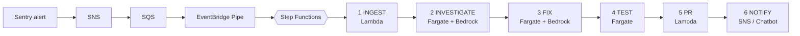

<div align="center">

# The Self-Healing Pipeline

### Code for the book *How I Taught My CI/CD Pipeline to Fix Itself at 2 AM*

An AI-assisted pipeline that catches a production error, finds the root cause, writes a fix, tests it, and opens a pull request. You review and merge.

[](LICENSE)


[Quick start](#quick-start) &nbsp;·&nbsp; [How it works](#how-it-works) &nbsp;·&nbsp; [Configuration](#configuration) &nbsp;·&nbsp; [Book examples](#book-examples) &nbsp;·&nbsp; [Safety](#safety-model)

</div>

---

## Why this exists

Most on-call pain is the same few problems fixed twice. Alerts fire, someone digs through logs, finds a null check or a bad config, patches it, and goes back to bed. This repository is a working version of the system the book describes: the machine does the digging and drafts the fix, and a human makes the call.

**Your only job is to read the pull request.**

## How it works



| Stage | What happens |
|---|---|
| **1. Ingest** | Validates the webhook, pulls the last CloudWatch log lines, and applies an atomic per-service rate limit in DynamoDB. |
| **2. Investigate** | Clones your repo, reads the files named in the stack trace, and asks Claude on Amazon Bedrock for a root cause with a **0-100 confidence score**. |
| **3. Fix** | At confidence 60 or above, generates a unified diff, checks it against a path allowlist, and pushes a `healer/...` branch. Below 60 it writes an investigation report instead. |
| **4. Test** | Runs type-check, unit tests and lint on the changed files. |
| **5. PR** | Opens a pull request with the investigation, confidence score and test results. |
| **6. Notify** | Publishes to an SNS topic, which can feed AWS Chatbot (Slack), email or any subscriber. |

Stages hand data to each other through S3, because Step Functions `ecs:runTask.sync` does not return a task's output.

## Quick start

**Prerequisites:** an AWS account with Bedrock model access enabled, Docker, the AWS CLI, Node.js 22, and a GitHub fine-grained token (`Contents: write`, `Pull requests: write`). Sentry is optional because you can start an execution by hand.

```bash
git clone https://github.com/dharmendradevops11/the-self-healing-pipeline.git
cd the-self-healing-pipeline/infrastructure/healer

npm ci
npm run type-check && npm test      # 12 tests, 4 suites
npm run build && npm run build:tasks
```

Then push the container image, upload the Lambda bundles, and deploy the CloudFormation stack. The full walkthrough, with every command, is in **[docs/PIPELINE_SETUP.md](docs/PIPELINE_SETUP.md)**.

> **Try it in a non-production AWS account first.** The pipeline pushes branches and opens pull requests against the repository you point it at, and it calls Bedrock, which is billed per use.

## Configuration

Setup is configuration. A standard deployment needs no code changes.

| Setting | Where | What it is |
|---|---|---|
| `ProjectName`, `Environment` | CloudFormation parameters | Prefix and stage used to name every resource |
| `GithubRepoOwner`, `GithubRepoName`, `GithubBaseBranch` | CloudFormation parameters | The repository you want healed |
| `GithubTokenSecretArn`, `SentryAuthTokenSecretArn`, `SentryWebhookSecretArn` | CloudFormation parameters | Secrets Manager ARNs, read at runtime and never stored in the template |
| `EcsClusterArn`, `SubnetId`, `SecurityGroupId`, `HealerImageUri` | CloudFormation parameters | Your network and the ECR image you push |
| `BedrockModelId`, `BedrockRegion` | CloudFormation parameters | Confirm the model is enabled in your account and not retired |
| `SlackWebhookUrl` | CloudFormation parameter | Still required by the template but unused by the current code. Any placeholder works. |
| `SafePathPrefixes` | CloudFormation parameter | Comma-separated directories the AI may change in your repo. Defaults to `src/,lib/,app/,packages/,server/,api/`. **Set this to match your repository layout**, otherwise the fix stage rejects every change. |
| `GitAuthorEmail` | CloudFormation parameter | Git author email on healer commits. Defaults to `healer@example.com`. |

The TEST stage installs dependencies with `pnpm`, so the repository being healed should use pnpm.

## Safety model

The design assumes the model will sometimes be wrong, so every step limits the damage.

- **Humans merge.** The pipeline can only open a pull request. It never merges.
- **Confidence gate.** Below 60 it produces a report and no code change.
- **Path allowlist.** Diffs outside `SafePathPrefixes` are rejected. `infrastructure/`, `.github/`, migrations, Dockerfiles, YAML and shell scripts are always forbidden.
- **Rate limit.** Atomic DynamoDB counter, three runs per service per hour (set by `MAX_PER_HOUR` in `lambdas/shared/dynamodb-client.ts`).
- **Scoped IAM.** Separate roles for Lambdas, tasks, the state machine and the pipe, with `ecs:RunTask` limited to the healer task definitions.
- **No API keys to manage.** Claude runs through Bedrock inside your own AWS account, and tokens come from Secrets Manager.

## Book examples

Every code listing from the book is here too.

- **[`companion_code/`](companion_code/)**: six standalone Python reference implementations indexed in Appendix D (anomaly detection, rate limiting, remediation routing, webhook signature validation, failure observation, secret scrubbing), plus a seventh correlation module. They are conceptual companions to the pipeline stages and are not imported by the TypeScript code.

  ```bash
  cd companion_code
  pip install -r requirements.txt
  python -m unittest discover -s tests -v    # 14 tests
  ```

- **[`chapters/`](chapters/)**: one folder per chapter with every listing in reading order. Most are excerpts that illustrate a single idea, and each chapter README maps files to book sections.

| # | Chapter | Code files |
|---|---|---|
| 1 | [The Real Cost of Pipeline Failures](chapters/chapter-01-the-real-cost-of-pipeline-failures/) | 3 |
| 2 | [Beyond the Marketing Buzzword: A Working Definition](chapters/chapter-02-beyond-the-marketing-buzzword-a-working-definition/) | 4 |
| 3 | [Triage and the 3 AM Alarm: What Machine Learning Actually Does in DevOps](chapters/chapter-03-triage-and-the-3-am-alarm-what-machine/) | 14 |
| 4 | [The 47 Dashboards Nobody Looked At](chapters/chapter-04-the-47-dashboards-nobody-looked-at/) | 11 |
| 5 | [The Alert That Cried Wolf 200 Times](chapters/chapter-05-the-alert-that-cried-wolf-200-times/) | 9 |
| 6 | [Detecting the Slow-Motion Outage](chapters/chapter-06-detecting-the-slow-motion-outage/) | 8 |
| 7 | [Remediation: When to Pull the Plug Automatically](chapters/chapter-07-remediation-when-to-pull-the-plug-automatically/) | 14 |
| 8 | [What Happens When You Give an AI Write Access](chapters/chapter-08-what-happens-when-you-give-an-ai-write/) | 8 |
| 9 | [The Trust Problem: Junior Swagger vs. Senior Scars](chapters/chapter-09-the-trust-problem-junior-swagger-vs-senior-scars/) | 7 |
| 10 | [So I Killed a Pod: Validating the Healer with Chaos](chapters/chapter-10-so-i-killed-a-pod-validating-the-healer/) | 4 |
| 11 | [The New Attack Surface: Security Risks of Autonomous Pipelines](chapters/chapter-11-the-new-attack-surface-security-risks-of-autonomous/) | 13 |
| 12 | [Why Visibility Looks Like Failure](chapters/chapter-12-why-visibility-looks-like-failure/) | 3 |
| 13 | [The State of Autonomous Pipelines: An Honest Assessment](chapters/chapter-13-the-state-of-autonomous-pipelines-an-honest-assessment/) | 7 |
| 14 | [One Team Is Easy. Two Hundred Services Is Not.](chapters/chapter-14-one-team-is-easy-two-hundred-services-is/) | 2 |
| 15 | [The ROI of Self-Healing: The Economics of Firefighting](chapters/chapter-15-the-roi-of-self-healing-the-economics-of/) | – |
| 16 | [Four Incidents the Pipeline Changed](chapters/chapter-16-four-incidents-the-pipeline-changed/) | – |
| 17 | [Start Local, Stay Local Until You Can’t](chapters/chapter-17-start-local-stay-local-until-you-cant/) | 9 |
| 18 | [Where Autonomy Fails: The True Limitations](chapters/chapter-18-where-autonomy-fails-the-true-limitations/) | – |
| 19 | [Appendices](chapters/chapter-19-appendices/) | – |

Chapters 15, 16, 18 and 19 have no code listings. All account IDs, ARNs, tokens and endpoints in this repository are placeholders.

## Repository layout

```text
.
├── infrastructure/
│   ├── cloudformation/     # self-healing-pipeline.yaml
│   └── healer/             # TypeScript Lambdas, Fargate tasks, Dockerfile, tests
├── companion_code/         # Python reference implementations + tests
├── chapters/               # Code listings, one folder per book chapter
├── docs/PIPELINE_SETUP.md  # Full deployment guide and troubleshooting
└── .manuscript_changelog.md
```

## Contributing and errata

Found a bug or a mistake in the book? Please open an issue. Corrections are tracked in [`.manuscript_changelog.md`](.manuscript_changelog.md).

## License

Apache License 2.0, see [LICENSE](LICENSE). Copyright (c) 2026 Dharmendra Ahuja.

This code is provided for illustrative and reference purposes, without warranty of any kind. Review, test and validate everything in a secure staging environment before using it in production.
